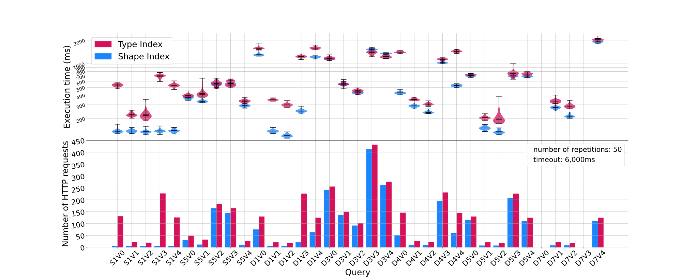

# Opportunities for Shape-based Optimization of Traversal Queries over Decentralized Environments

Short paper submitted for the ["Alberto Mendelzon International Workshop on Foundations of Data Management"](https://amw2024.github.io/). 
The experiment repository is available via [this hypermedia link](https://github.com/constraintAutomaton/amw_shape_index_results/tree/main).

## Building a PDF
The authors compiled the PDF version using `pdflatex` (you can use your favorite latex compiler).
We created a `makefile` to facilitate the building of the PDF version.
One can simply execute `make main.pdf` or `make` to produce the PDF version if `pdflatex` and the other dependencies of the tex live suite are installed on the machine of the user.

## Abstract
Linked Data on the Web can be considered as one very large Decentralized Knowledge Graph. While centralized
query processing approaches are well-understood, decentralization-friendly alternatives such as Link Traversal
Query Processing (LTQP) that doesn’t require prior indexing are insufficiently performant for real-world use cases.
Indeed, LTQP approaches on the web are difficult due to the pseudo-infinite size of the domain, the unstructured
nature of the medium, and the lack of a priori information for query planning. For most traversal-based queries the
execution of a large number of HTTP requests is the bottleneck. However, in practice, queries target small subsets
of the Web. Web subsets are always structured either implicitly or explicitly. Explicit structure can be described
via hypermedia descriptions. Using those structural information query engines can improve their performances
by reducing their search domain. Our goal is to explore the opportunities of using mappings between RDF data
shapes and distributed RDF subgraphs for the purpose of improving the performance of traversal-based queries.
In this article, we discuss these opportunities, present preliminary results, and discuss potential future work. Our
initial experiments show that with little maintenance and work from the server, our method can significantly
reduce the number of links traversed to answer a query leading to a substantial reduction in query execution time
compared to the state of the art. In future work, we are going to formalize our method, perform more extensive
experiments, and design algorithms for query planning that take into consideration this shape metadata.

# Results
Here is the figure presenting the main result

The query execution time distribution (the upper graph) and the number of HTTP requests (the lower graph).
The results of our approach are in blue and the state of the art (type index with LDP) in red.
The results have been generated with 50 repetitions and a timeout of 6000 ms.
The queries are denoted with first the initial of the query template (e.g., S1 for interactive-**s**hort-**1**), and the version of the concrete query (e.g., V0). 
Values not present in the plot indicate that the query timeout before the end of the execution.

## Conclusion 

Our approach of shape-based optimization for LTQP over decentralized environments consists of
exploiting the structure provided by annotated data sources with RDF shape metadata. We propose
the usage of a shape index as a hypermedia descriptor for structural information. This shape index
maps a subdomain of the web with RDF data shapes validating its content. We propose to solve a
query-shape containment problem analogous to the classic query containment problem for dynamic
source selection using an adaptative lookup policy. Our preliminary results are highly promising, as
our early experiments show that this approach can significantly reduce the query execution time and
the number of HTTP requests. In future work, we will provide a complete implementation of our
containment algorithm, a formalization of the approach and a more detailed analysis of the performance
of the method. Furthermore, we intend to explore the usage of shapes in the context of LTQP for query
planning and link prioritization.
